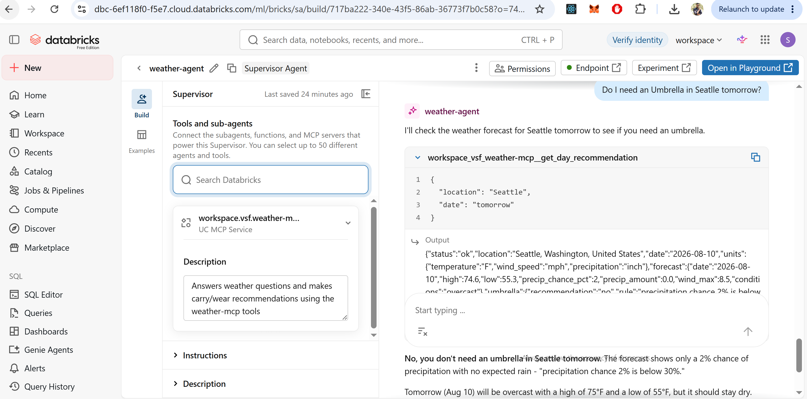
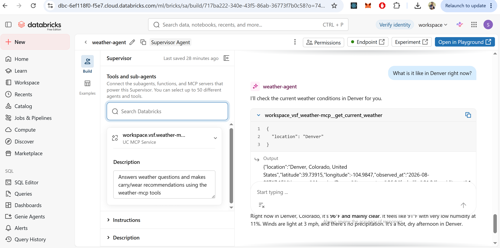
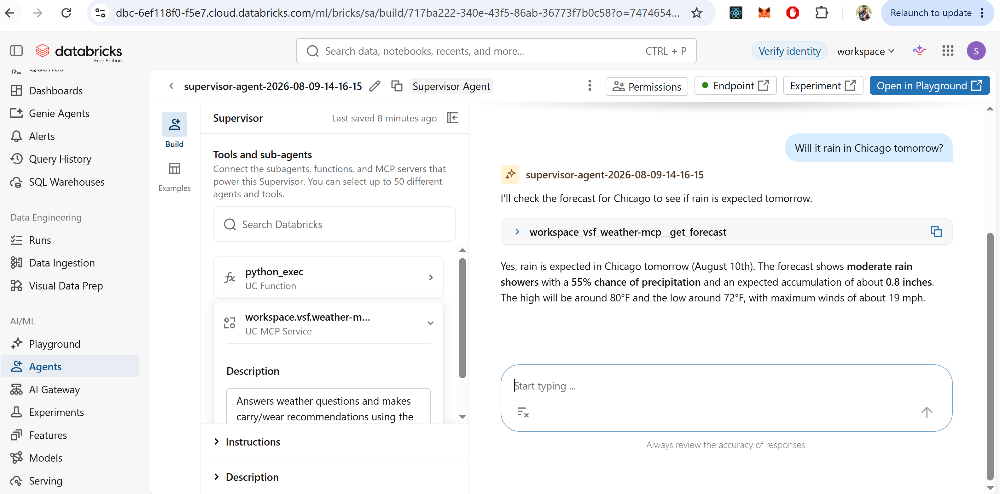
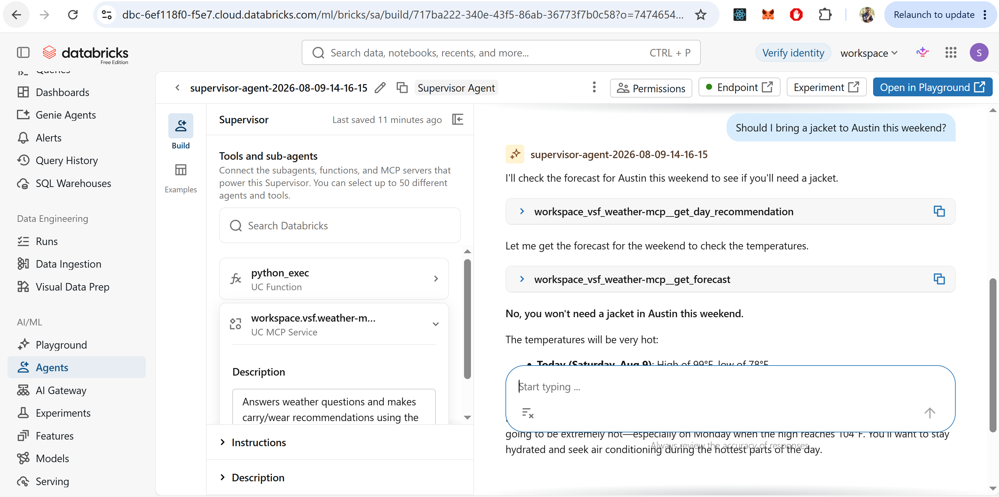
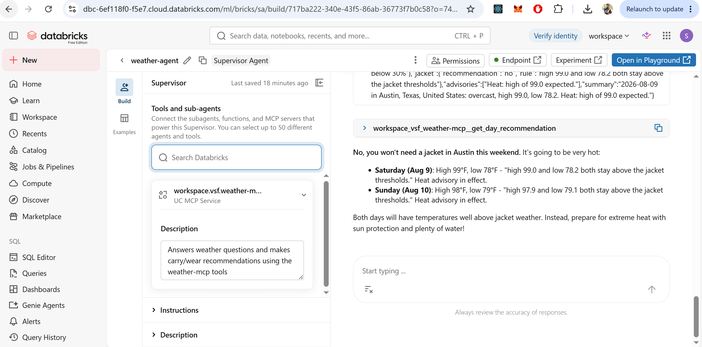
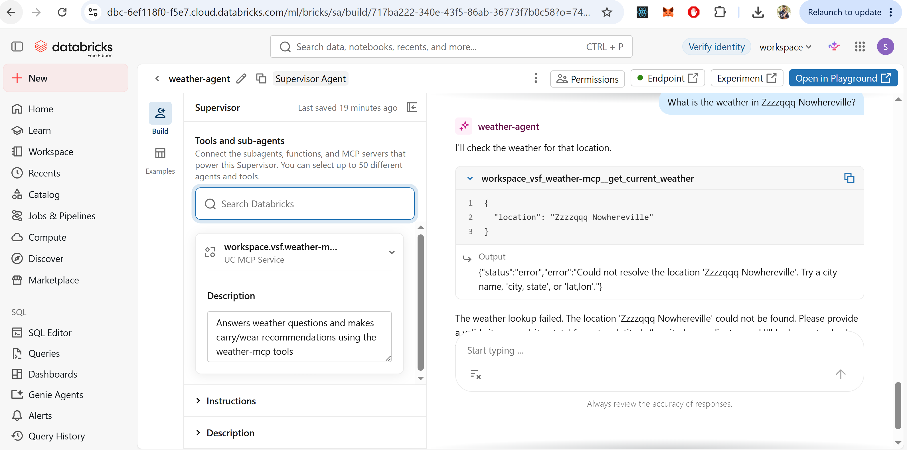

# Weather MCP Server and Agent Bricks Agent

An MCP server exposing weather forecast tools, deployed as a Databricks App, registered
through the Databricks AI Gateway as an external MCP service, and consumed by an Agent
Bricks Supervisor Agent that answers natural language weather questions.

Built as Day 3 homework, following the structure of the Alpaca paper-trading MCP server
reference repo (`mcp_server/alpaca_mcp_server.py` plus `alpaca_broker.py`).

## Architecture

```
User question
     |
     v
Agent Bricks Supervisor Agent          (system prompt, tool routing)
     |
     v
Databricks AI Gateway                  (workspace.vsf.weather-mcp, OAuth M2M)
     |
     v
Databricks App: weather-mcp            (FastMCP, streamable HTTP at /mcp)
     |
     +-- weather_mcp_server.py         (thin @mcp.tool functions, threshold logic)
     |
     +-- weather_client.py             (all HTTP calls, parsing, retries)
              |
              v
        Open-Meteo API                 (geocoding + forecast, no API key)
```

## Deployment

- Databricks App: https://weather-mcp-7474654713254531.aws.databricksapps.com
- MCP endpoint: the same URL with `/mcp` appended
- AI Gateway MCP service: `workspace.vsf.weather-mcp`
- Agent Bricks agent: `weather-agent` (Supervisor Agent)
- Workspace: https://dbc-6ef118f0-f5e7.cloud.databricks.com
- Source repo: https://github.com/Sheethal-crypto/weather-mcp

## Weather API and authentication

**Open-Meteo**, chosen because it requires no signup and no API key. Two endpoints are
used: the geocoding API to turn a place name into coordinates, and the forecast API for
current conditions and daily forecasts. The forecast endpoint only accepts coordinates,
so geocoding is a required first hop rather than a convenience.

**On the secrets requirement:** the assignment requires that any API key be stored as a
Databricks secret and never committed. Open-Meteo has no credential of any kind, so there
is nothing to store. The requirement is satisfied by the choice of provider rather than by
secret handling code. There are no keys, tokens, or credentials anywhere in this repo. The
one credential in the system, the OAuth client secret for the AI Gateway connection, is
held by Databricks in the Unity Catalog connection object and never appears in source.

## Tools

All three are defined in `weather_mcp_server.py` with `@mcp.tool` decorators. Each returns
a dict carrying a `status` field of `ok` or `error`, so a failure is a value the agent can
reason about rather than an exception.

### `get_current_weather(location, units="imperial")`

Current observed conditions. Returns temperature, feels-like, humidity, wind speed,
precipitation, a plain-English conditions string, and the observation timestamp in the
location's own timezone.

### `get_forecast(location, days=3, units="imperial")`

Daily forecast, day one being today in the location's timezone. Each day carries high,
low, precipitation chance, expected accumulation, max wind, and conditions. Days are
clamped to the 1 to 16 range Open-Meteo supports.

### `get_day_recommendation(location, date=None, units="imperial")`

The derived judgment tool. It does not pass the forecast through. It applies thresholds
and returns both the recommendation and the rule that produced it.

**Umbrella rule.** The obvious implementation is a single probability threshold, and it is
misleading: a 45 percent chance of 0.01 inches is a passing sprinkle, while a 35 percent
chance of half an inch soaks you. So the rule uses two factors.

- Yes, when precipitation chance is at or above 50 percent
- Yes, when chance is at or above 30 percent AND expected accumulation is at least 0.10 inches
- Maybe, when chance is at or above 30 percent with less accumulation than that
- No, otherwise

**Wind override.** If max wind exceeds 25 mph, an umbrella inverts and becomes useless, so
the recommendation switches to a rain jacket instead. This is a judgment the raw API cannot
provide and is the clearest evidence the tool is not a passthrough.

**Jacket rule.** Yes when the daytime high is below 62F, or when the overnight low is below
50F. The second clause exists because the overnight low is what catches people out on
evening plans.

**Advisories.** Raised for max wind above 30 mph, a daytime high above 95F, and any
thunderstorm in the day's conditions.

Every threshold is a named module constant, so the values are visible in one place rather
than scattered through the branching.

## Repository layout

```
weather_client.py        Open-Meteo adapter. All HTTP and parsing. No MCP imports.
weather_mcp_server.py    FastMCP server. Three thin tools plus threshold logic.
test_tools.py            Async MCP client test against a local server, 5 checks.
test_deployed.py         Same, against the deployed app over OAuth.
app.yaml                 Databricks Apps start command.
requirements.txt         Runtime dependencies for the deployed app.
.gitignore               Excludes .venv, __pycache__, .pyc and .env from the repo.
images/                  Demo screenshots.
```

The adapter split is deliberate and matches the reference repo: `weather_client.py`
contains every `requests` call in the project, and the `@mcp.tool` functions do nothing but
resolve arguments, call the adapter, catch `WeatherAPIError`, and return a dict.

## Error handling

Failures surface as clean messages rather than stack traces at three levels.

`weather_client.py` retries connection errors, timeouts, 429 and 5xx with bounded backoff
across three attempts. It does not retry other 4xx, because a 400 from Open-Meteo means the
request itself is malformed and a second identical attempt fails identically. Exhausted
retries and unresolvable locations raise `WeatherAPIError`.

`weather_mcp_server.py` catches `WeatherAPIError` at the tool boundary and returns
`{"status": "error", "error": "..."}`.

The agent's system prompt instructs it to report the error and not substitute an estimate.
Demo 5 below shows this working end to end.

## Setup

### Local

```
python -m venv .venv
.\.venv\Scripts\Activate.ps1
pip install fastmcp requests
python weather_mcp_server.py
```

`test_deployed.py` additionally needs `pip install databricks-sdk`. That is a local
development dependency, deliberately kept out of `requirements.txt` because that file covers
only what the deployed app installs.

Serves at `http://localhost:8000/mcp`. Run `python test_tools.py` in a second shell for the
five-check smoke test.

### Deploy as a Databricks App

1. Clone this repo into the workspace as a Git folder.
2. Compute, Apps, Create app, source set to that Git folder, deploy.
3. Databricks reads `app.yaml` for the start command and installs `requirements.txt`.

The deployed MCP endpoint is the app URL with `/mcp` appended.

### Register as an external MCP service

Agents, MCPs, Connect an existing MCP server. Server URL is the app URL plus `/mcp`.

**Authentication is the non-obvious part.** Databricks Apps sit behind OAuth, and custom
MCP servers on Apps reject personal access tokens. Dynamic Client Registration also fails,
because the Databricks OIDC metadata contains no `registration_endpoint`. What works is
**OAuth M2M**:

- Create a service principal and generate an OAuth secret on it
- Grant that service principal CAN USE on the app, otherwise the token authenticates but the app still refuses
- Token endpoint: `https://<workspace-host>/oidc/v1/token`
- Scope: `all-apis`

The registered service is `workspace.vsf.weather-mcp` and loads all three tools.

## Agent configuration

Agent Bricks **Supervisor Agent**, with `workspace.vsf.weather-mcp` attached as its tool
source.

### System prompt

```
You are a weather assistant. You answer questions about current
conditions, forecasts, and what to wear or carry.

You have three tools:
- get_current_weather(location, units): conditions right now
- get_forecast(location, days): daily forecast, day one is today
- get_day_recommendation(location, date, units): applies threshold
  logic to decide about umbrellas, jackets, and advisories

Which tool to call:
- Questions about right now: get_current_weather
- Questions spanning multiple days, or asking for numbers across
  days: get_forecast
- Questions about whether to bring or wear something, or whether a
  day is suitable for an activity: get_day_recommendation

Rules:
- Never state a temperature, precipitation chance, wind speed, or
  condition that did not come from a tool call in this conversation.
  You have no weather knowledge of your own.
- Every tool returns a "status" field. If status is "error", tell
  the user the lookup failed and repeat the error message. Do not
  substitute your own estimate and do not retry with a different
  location unless the user asks.
- If the location is ambiguous, ask which one rather than guessing.
- When you use get_day_recommendation, state the threshold that
  fired, from the "rule" field. The user should understand why the
  answer is what it is, not just what it is.
- Forecast dates are in the location's timezone, not the user's.
```

The line carrying the most weight is "You have no weather knowledge of your own." Without
it, a model will answer a weather question from priors when a tool call fails, which is
precisely the hallucination the assignment warns against.

## Demonstrated conversations

### 1. Threshold logic, umbrella

**Question:** Do I need an umbrella in Seattle tomorrow?

**Tool called:** `get_day_recommendation`

**Answer:** No, you don't need an umbrella in Seattle tomorrow (August 10th). The
precipitation chance is only 2%, which is well below the 30% threshold. The forecast shows
overcast skies with a high of 75F and a low of 55F, but no rain is expected.

The agent states the threshold that fired rather than only the verdict, which is the
behavior the system prompt asks for and the point of the tool.



### 2. Current conditions

**Question:** What is it like in Denver right now?

**Tool called:** `get_current_weather`

**Tool output:**

```json
{"location":"Denver, Colorado, United States","latitude":39.73915,"longitude":-104.9847,
"observed_at":"2026-08-09T15:15","timezone":"America/Denver","temperature":92.3,
"feels_like":83.1,"humidity_pct":12,"wind_speed":12.8,"precipitation":0.0,
"conditions":"overcast","units":{"temperature":"F","wind_speed":"mph",
"precipitation":"inch"},"status":"ok"}
```

**Answer:** Right now in Denver, Colorado it's 92F and overcast. The humidity is quite low
at 12%, and it feels like 83F. Winds are blowing at about 13 mph, and there's no
precipitation currently. It's a hot, dry afternoon in Denver.



### 3. Multi-day forecast

**Question:** Will it rain in Chicago tomorrow?

**Tool called:** `get_forecast`

**Answer:** Yes, rain is expected in Chicago tomorrow (August 10th). The forecast shows
moderate rain showers with a 55% chance of precipitation and an expected accumulation of
about 0.8 inches. The high will be around 80F and the low around 72F, with maximum winds of
about 19 mph.



### 4. Multi-turn tool use

**Question:** Should I bring a jacket to Austin this weekend?

**Tools called:** `get_day_recommendation`, then `get_forecast`

**Answer:** No, you won't need a jacket in Austin this weekend. Today (Saturday, Aug 9):
high of 99F, low of 78F. Sunday (Aug 10): high of 98F, low of 79F. Monday (Aug 11): high of
104F, low of 79F. Even the overnight lows will stay in the upper 70s, which is well above
jacket weather.

The agent called `get_day_recommendation` and then `get_forecast`, but it built its answer
from the forecast numbers rather than from the recommendation's `rule` field. Demo 1 is the
contrasting case, where the rule that fired is cited directly in the answer.




### 5. Error handling

**Question:** What is the weather in Zzzzqqq Nowhereville?

**Tool called:** `get_current_weather`, returned `status: error`

**Answer:** The weather lookup failed. The location "Zzzzqqq Nowhereville" could not be
found. Please provide a valid city name, a "city, state" format, or latitude/longitude
coordinates, and I'll be happy to check the weather for you.

No weather was invented for a location that does not exist, and the agent asked for a
usable format instead of retrying blindly.



## Testing

`test_tools.py` runs five checks against a local server: tool discovery, all three tools,
and a deliberate failure case asserting that an unresolvable location returns
`status: error` rather than raising.

`test_deployed.py` runs the same MCP client against the deployed app, minting an OAuth
token through the Databricks CLI profile. This verifies the deployment independently of the
gateway and the agent.

Both connect over MCP and discover tools at runtime rather than importing the server module,
so they exercise the same protocol surface the agent uses.

## Known limitations

- No caching. Every tool call hits Open-Meteo. Well within the 10,000 calls per day
  non-commercial limit for this use, but it would matter at volume.
- Geocoding takes the first match. "Springfield" resolves to one of many without asking.
  The system prompt instructs the agent to ask about ambiguous locations, but the tool
  itself does not surface the alternatives.
- Thresholds are calibrated in Fahrenheit and mph. Passing `units="metric"` returns metric
  values but compares them against imperial thresholds, so imperial is the supported path
  for `get_day_recommendation`.
- Databricks Apps on Free Edition stop when idle. If the app is asleep, the gateway
  receives an HTML page instead of MCP protocol and tool registration fails until the app
  is restarted.

## Assignment requirements

| Requirement | Where it is met |
| --- | --- |
| FastMCP server with `@mcp.tool`, streamable HTTP | `weather_mcp_server.py`, three tools served over HTTP transport. See [Tools](#tools). |
| Separate adapter module, no raw `requests` calls in tool functions | `weather_client.py` holds every `requests` call in the project. See [Repository layout](#repository-layout). |
| API key stored as a Databricks secret (if the API needs one) | Open-Meteo needs no credential, so there is nothing to store. See [Weather API and authentication](#weather-api-and-authentication). |
| `requirements.txt` and `app.yaml`, deployed as its own Databricks App | Both at the repo root, deployed from a Git folder. See [Deploy as a Databricks App](#deploy-as-a-databricks-app). |
| Agent Bricks agent registered against the MCP server | `weather-agent` uses `workspace.vsf.weather-mcp` as its tool source. See [Agent configuration](#agent-configuration). |
| System prompt with tool routing and guardrails | Routing rules plus the no-invented-weather guardrail. See [System prompt](#system-prompt). |
| README with tools, setup, API and auth method | This file, covering [Tools](#tools), [Setup](#setup) and [Weather API and authentication](#weather-api-and-authentication). |
| Three or more demonstrated natural language questions | Five demonstrated, including an error case. See [Demonstrated conversations](#demonstrated-conversations). |
